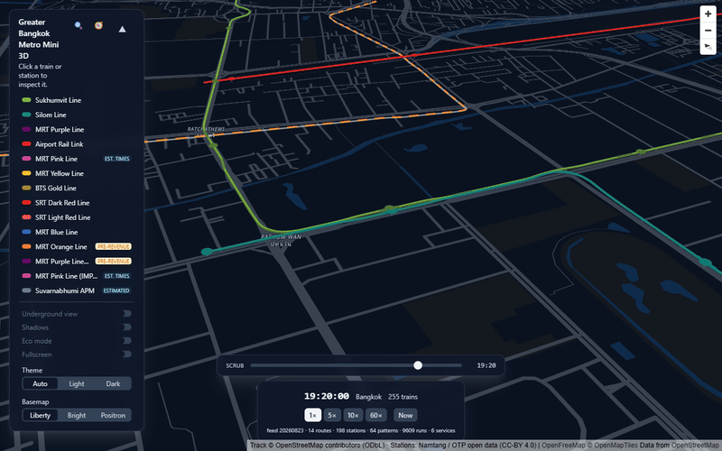
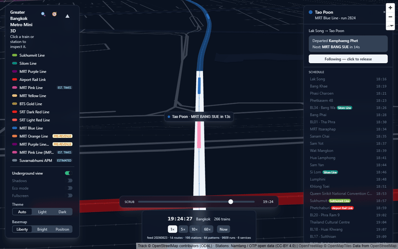
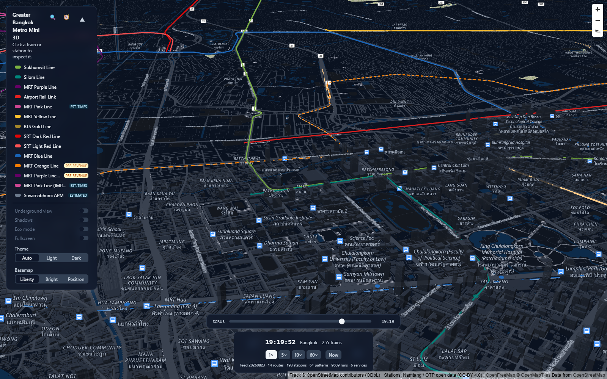
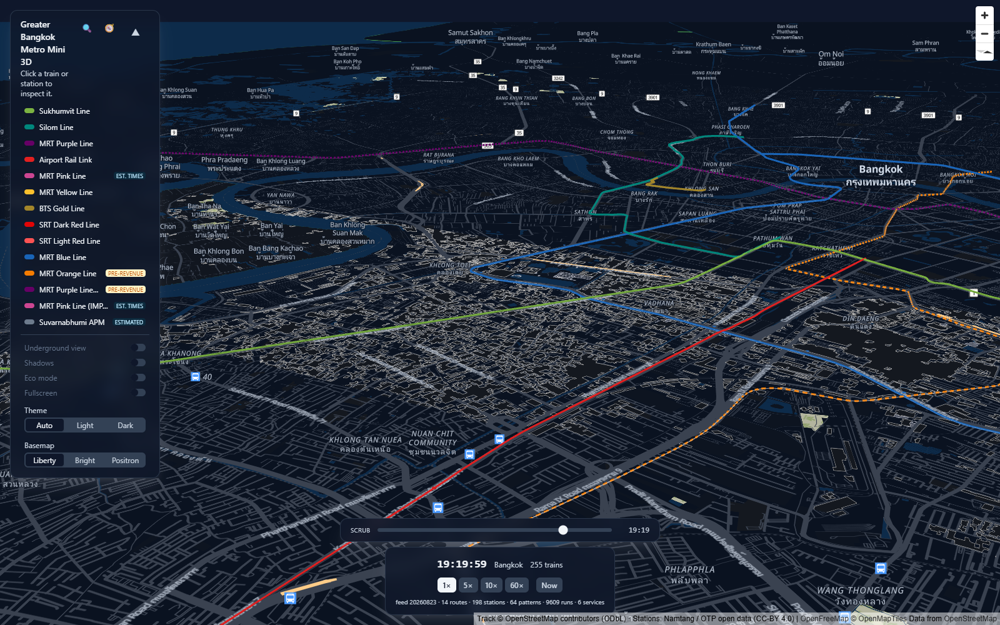
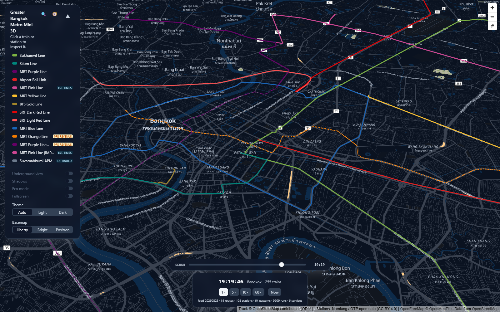

# Greater Bangkok Metro Mini 3D

> Interactive, web-based 3D visualization of Bangkok's rail transit network — trains moving on schedule along authentic geography, elevations, and timetables.

**Status:** 🚀 **Active & Production-Ready** — Simulating Greater Bangkok's 14 urban rail lines (12 simulated, 2 pre-revenue track-only), 198 stations, 9,609 daily scheduled runs with real-time Bangkok clock interpolation. **Repo:** [`tha-metro-mini-3d`](https://github.com/naiiytom/tha-metro-mini-3d)

---

## What it is

Greater Bangkok Metro Mini 3D renders the Bangkok Metropolitan Region's metro/rail lines as 3D track over a vector map and animates trains along them using published **static GTFS** timetables. Vehicle positions are computed by interpolating scheduled arrival/departure times — so you can watch the *scheduled* network at any moment, scrub through time, and follow individual trains.

> **Schedule-driven, not live.** Static timetables are interpolated to visualize where trains *should* be according to published operator schedules.

Full requirements live in [`docs/SRS.md`](./docs/SRS.md). For planned features, see [`docs/addition-roadmap.md`](./docs/addition-roadmap.md).

## Demo & Screenshots

### Live Demo Animations

| 3D Network Overview & Route Search | Zoomed-in Follow Camera & Orbit |
|---|---|
|  |  |

### Camera Angles

| Siam Station Closeup | Sukhumvit Elevated Track | System Overview |
|---|---|---|
|  |  |  |

## Features

- **3D Track Geometry & Elevation Profile**: Elevated (+12–22 m), at-grade (+0.5 m), and underground (−12 to −25 m) segments with smooth Catmull-Rom spline curves and ruling grade limiter (≤4%).
- **Schedule-Based Train Motion**: High-performance Wasm kinematics engine with smoothstep acceleration/deceleration easing, tangent heading, and 10 Hz worker evaluation.
- **Route Search (A → B Journey Planner)**: Timetable-aware RAPTOR router in Rust/Wasm computing fastest and fewest-transfers itineraries, transfer instructions, and interactive 3D track highlight arcs.
- **Station Search & Geolocation**: Bilingual (Thai/English) substring search and one-shot HTML5 Geolocation nearest-station finder.
- **Custom Rolling Stock Models**: Procedural 3D consist geometries tailored to each line (heavy rail, monorail, APM, commuter) with authentic car counts, nose profiles, roof kits (overhead pantographs on 25 kV AC lines, third-rail / straddle-beam elsewhere), route livery bands, glowing cabin windows at night, and lazy GLB model loading hook.
- **Time Controls**: Real-time Bangkok clock (UTC+7), 1×/5×/10×/60× speed multipliers, and continuous time-scrubbing.
- **Camera Modes**: Free orbit camera, third-person train follow camera with user yaw orbit, altitude-aware hit-testing, and hover cursor feedback.
- **Lighting & Atmosphere**: Real-time solar position calculations (NOAA), sunset sky dome, and WCAG 3:1 emissive contrast floors for night legibility.
- **Underground Mode**: Opacity-based view mode with automatic altitude-based engagement and hysteresis when following trains into tunnels.
- **Theming & Basemap Styles**: Auto/Light/Dark theme modes and vector basemap styles (OpenFreeMap Liberty, Bright, Positron).
- **Responsive UI & Performance**: Glassmorphic panels with collapsible line selector, bottom-sheet layout on mobile (<768px), 1 Hz Eco Mode throttling, and Full-Screen mode.

### Camera controls

| Gesture | Effect |
|---------|--------|
| Left-drag | Pan |
| Scroll wheel | Zoom |
| Press the wheel + drag, right-drag, or ctrl + left-drag | Orbit — drag up to tilt toward the horizon, down to flatten toward top-down, sideways to swing the compass bearing |

Orbiting moves both axes in one motion, so a diagonal drag tilts and turns together.

## Coverage

Operational lines receive full simulation (track + trains). **14 lines are registered (12 simulated, 2 pre-revenue track-only)**: 198 stations, 9,609 expanded runs. MRT Blue features genuinely mixed underground/elevated structure (234 elevated + 260 underground track points).

**MRT Orange and MRT Purple Phase 2 are in the registry as track-only, pre-revenue lines** — track geometry renders (dashed centerline, desaturated deck, a `LineSelector` badge), no trains, zero stations. Neither line has a route relation in OSM yet, so their track is constructed directly from name-tagged `railway=construction` ways. See [CLAUDE.md](./CLAUDE.md)'s implementation notes for details.

| Line | Type | Operator | Structure | Consist / Model | Status |
|------|------|----------|-----------|-----------------|--------|
| BTS Sukhumvit (Green) | Heavy Rail | BTSC | Elevated | 4-car EMU, third rail | Full |
| BTS Silom (Green) | Heavy Rail | BTSC | Elevated | 4-car EMU, third rail | Full |
| MRT Purple | Heavy Rail | BEM | Elevated | 3-car EMU, third rail | Full |
| Airport Rail Link (ARL) | Express / Commuter | Asia Era One | Elevated | 3-car EMU, pantograph | Full |
| MRT Pink | Monorail | NBM | Elevated | 4-car monorail, straddle | Full (Est. transit times) |
| MRT Yellow | Monorail | EBM | Elevated | 4-car monorail, straddle | Full |
| BTS Gold | APM | BMA/KT (BTSC) | Elevated | 2-car APM, rubber-tyred | Full |
| SRT Dark Red | Commuter Rail | SRTET | Elevated / At-grade | 4-car EMU, pantograph | Full |
| SRT Light Red | Commuter Rail | SRTET | Elevated / At-grade | 4-car EMU, pantograph | Full |
| MRT Blue | Heavy Rail | BEM | Underground / Elevated | 3-car EMU, third rail | Full |
| MRT Orange | Heavy Rail | MRTA | Underground / Elevated | — | Track-only (Pre-revenue) |
| MRT Purple Phase 2 | Heavy Rail | MRTA / BEM | Underground / Elevated | — | Track-only (Pre-revenue) |
| MRT Pink (IMPACT Link) | Monorail | NBM | Elevated | 4-car monorail, straddle | Full (Est. transit times) |
| Suvarnabhumi APM | APM | AOT | Underground | 2-car APM, Airval | Full (Synthetic 24h schedule) |

> **Schedule provenance & disclosures:**
> - **Pink Line & Pink Spur**: The Namtang GTFS feed omits transit times (0 s transit / 60 s dwell placeholder). Inter-station travel times are estimated from track arc length using a speed derived at build time from the MRT Yellow Line (same rolling stock and profile).
> - **Suvarnabhumi APM**: AOT publishes no open GTFS feed. The APM operates continuously 24/7; its timetable is synthesized from observed operational headways (180 s headway, 120 s runtime, 40 s dwell) and clearly badged in the UI.
> - **MRT Orange & Purple Phase 2**: Under construction (projected 2027–2030). Rendered as track geometry only with no passenger simulation.

### Track geometry provenance (OSM relations)

Every line's 3D track polyline comes from a **pinned** OpenStreetMap route relation or tagged construction way patterns. Station coordinates for simulated lines come from the Namtang GTFS feed and OSM node tags.

| Line | OSM Identifier | GTFS `route_id` |
|------|----------------|-----------------|
| BTS Sukhumvit | Relation [444651](https://www.openstreetmap.org/relation/444651) + Node `5388599065` | `1` |
| BTS Silom | Relation [2067854](https://www.openstreetmap.org/relation/2067854) | `2` |
| MRT Purple | Relation [6988563](https://www.openstreetmap.org/relation/6988563) | `4` |
| Airport Rail Link | Relation [2148241](https://www.openstreetmap.org/relation/2148241) | `5` |
| MRT Pink | Relation [16740886](https://www.openstreetmap.org/relation/16740886) | `2436` (Trunk) |
| MRT Yellow | Relation [15806897](https://www.openstreetmap.org/relation/15806897) | `2224` |
| BTS Gold | Relation [11681439](https://www.openstreetmap.org/relation/11681439) | `2025` |
| SRT Dark Red | Relation [13058384](https://www.openstreetmap.org/relation/13058384) | `2026` |
| SRT Light Red | Relation [13178788](https://www.openstreetmap.org/relation/13178788) | `2027` |
| MRT Blue | Relation [444659](https://www.openstreetmap.org/relation/444659) | `3` |
| MRT Orange | Ways matching `รถไฟฟ้าสายสีส้ม...` | `null` (Pre-revenue) |
| MRT Purple Phase 2 | Ways matching `สายสีม่วงใต้` | `null` (Pre-revenue) |
| MRT Pink (IMPACT Link) | Relation [19149752](https://www.openstreetmap.org/relation/19149752) | `2436` (Claimed stops `16936`, `16937`) |
| Suvarnabhumi APM | Relation [19955655](https://www.openstreetmap.org/relation/19955655) + Nodes `13373875189`, `13373875190` | `null` (Synthetic schedule) |

Source of truth for this table: `tools/lines.config.mjs`'s `LINES` registry.

## Tech stack

| Layer | Technology |
|-------|-----------|
| UI | React 19, Tailwind CSS v4, Lucide, Zustand |
| Build | Vite + TypeScript |
| Base map | MapLibre GL JS v6 (vector tiles, 3D building extrusions) |
| 3D | Three.js via a custom MapLibre WebGL layer |
| Simulation core | Rust → WebAssembly (`wasm-pack`), executed in a Web Worker |
| Data pipeline | Rust CLI: GTFS ZIP → compact binary cache (`.tmb`) + OpenStreetMap Overpass geometry |

See [§3A of the SRS](./docs/SRS.md) for design rationale and key architectural decisions.

## Project structure

```
tha-metro-mini-3d/
├── rust-engine/          # Rust Wasm simulation core & CLI preprocessor
│   ├── sim-core/         # Pure kinematics, RAPTOR route planner, cache model
│   ├── wasm/             # wasm-bindgen WebAssembly interface
│   └── preprocessor/     # GTFS expansion & binary serialization CLI
├── src/                  # Vite + React frontend
│   ├── components/       # UI panels: Inspector, StationBoard, RoutePlanner, StationSearch
│   ├── map/              # MapLibre ↔ Three.js bridge, vehicle manager, camera controls
│   ├── route/            # Route planning state & UI disclosures
│   ├── search/           # Station search & combobox state reducer
│   ├── stores/           # Zustand application store
│   └── types/            # TypeScript data models
├── tools/                # Overpass data fetch, GTFS fetch, and validation tests
├── index.html
└── vite.config.ts
```

## Getting started

> Prerequisites: [Node.js](https://nodejs.org/) 18+. The built Wasm engine (`src/sim/pkg/`) and binary timetable (`public/data/network.tmb`) are committed, so a Rust toolchain is **only** needed to regenerate them ([Rust](https://rustup.rs/) + `wasm32-unknown-unknown` target + [`wasm-pack`](https://rustwasm.github.io/wasm-pack/); see `rust-engine/`).

```bash
# clone
git clone https://github.com/naiiytom/tha-metro-mini-3d.git
cd tha-metro-mini-3d

# install deps and run the dev server
npm install
npm run dev
```

Other scripts:

| Command | What it does |
|---------|--------------|
| `npm run build` | Type-check (`tsc -b`) + production build to `dist/` |
| `npm run typecheck` | Type-check only |
| `npm test` | Vitest unit test suite (47 test files, 445 tests covering pure helpers, calculations, shaders, and UI components) |
| `npm run preview` | Serve the production build locally |
| `npm run data:fetch [lineKey ...]` | Regenerate `src/data/network.json` — every registry line's track geometry + stations from OpenStreetMap (Overpass) |
| `npm run data:fetch-gtfs` | Download fresh Namtang GTFS feed zip to `.gtfs-cache/` |
| `node tools/inspect-gtfs.mjs <gtfs-dir>` | Read-only: print every route in an extracted GTFS feed (id, agency, names, colour, trip count, frequencies) |
| `npm run screenshot -- [url] [outDir]` | Headless-browser screenshots from several camera poses |
| `npm run check:bundle` | NF2 bundle-budget gate against a **production** build (asserts gzip total ≤ 5.00 MB) |

Rust toolchain scripts (see [CONTRIBUTING](./docs/CONTRIBUTING.md)):

| Command | What it does |
|---------|--------------|
| `npm run rust:test` | `cargo test` across the `rust-engine/` workspace (65 unit tests) |
| `npm run rust:lint` | `cargo clippy --workspace --all-targets` |
| `npm run rust:fmt` | `cargo fmt --all` |
| `npm run wasm:build` | Rebuild the Wasm engine into `src/sim/pkg/` (committed output) |
| `npm run data:preprocess -- --gtfs <gtfs-dir>` | Regenerate `public/data/network.tmb` for the whole registry from an extracted GTFS feed |

## Data & licensing

- Transit schedules & station coordinates: static **GTFS** ([Namtang / OTP open-data programme](https://namtang-api.otp.go.th/opendata), CC-BY 4.0).
- Track geometry: **OpenStreetMap** — © OpenStreetMap contributors, [ODbL](https://opendatacommons.org/licenses/odbl/); attribution required (rendered in the map attribution control).
- Base map: [OpenFreeMap](https://openfreemap.org/) vector tiles (Liberty, Bright, Positron styles).
- Any scraped source is a fallback only, used in the offline preprocessor, subject to the source's terms.

## Contributing

Contributions are welcome. Start with [CONTRIBUTING.md](./docs/CONTRIBUTING.md) — it covers setup, codebase structure, and architectural conventions checked in review. By participating you agree to the [Code of Conduct](./docs/CODE_OF_CONDUCT.md).

## License

Source code is licensed under the [MIT License](./LICENSE).

Bundled data keeps its own terms: OpenStreetMap-derived track geometry is ODbL, and the Namtang GTFS-derived timetables and station coordinates are CC-BY 4.0. Both attributions render in the map's attribution control and must be kept in any redistribution.

---

*This is a fan/hobby visualization project and is not affiliated with any transit operator.*
